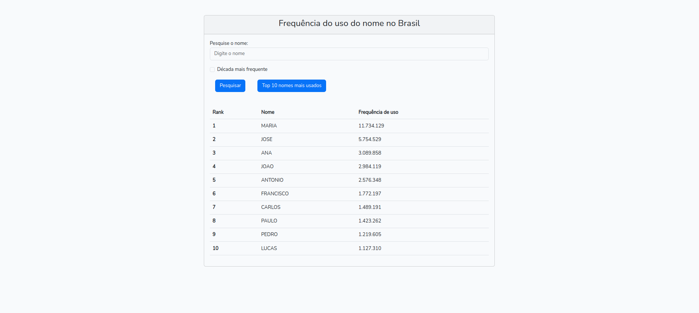

# Projeto Nomes mais usados no Brasil
Este projeto tem como propósito o estudo e aperfeiçoamento no framework Laravel e VUE.JS, portanto está livre para ser usado como estudo ou qualquer outra aplicação.
Tem como funcionalidades a consulta da api criada por mim que consulta a [API do IBGE](https://servicodados.ibge.gov.br/api/docs/nomes?versao=2), retornando a frequência do uso do nome inserido, a década em que mais foi utilizado ou um top 10 dos nomes mais usados no Brasil.


## Capturas de tela 🖥️





## Instalação 🛠️

Clonagem de repositório:

```bash
    git clone https://github.com/DevNetinho/pj-nomes.git
```
   

Instalação de dependências do Laravel e do Vue com os comandos:

```bash
    composer install    
    npm install
```

Executar as migrations:

```bash
    php artisan migrate
```

Iniciar servidor Laravel e depois o VUE com:

```bash
    php artisan serve
    npm run dev
```
## Aprendizados 📚

Meus principais aprendizados neste projeto incluem: Conhecimentos dos mais variados códigos HTTP como 404, 400, 500 etc. aperfeiçoamento no desenvolvimento de uma API REST que tem como base outra [API REST](https://servicodados.ibge.gov.br/api/docs/nomes?versao=2), isto inclui o aprendizado de novas técnicas para desenvolvimento de uma API. Aprimoramento dos conceitos do VUE.JS como a utilização de components, methods e o axios para requisições na API.